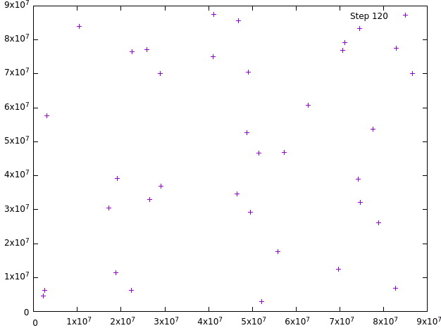

# N-problem-project

To compile: For the N^2 version, go into the Naive folder and run make to compile program 1 and program 2. For the Barnes-Hut version, go into either Serial/Parallel directory, and run ```make``` which should create a ```BarnesHut``` executable. Then input the arguments as stated in the following order:

```
gnumBodies:	the number of bodies
numSteps:	the number of time steps in the simulation
far:	the distance used to decide when to approximate (Barnes-Hut programs only)
numWorkers:	the number of workers (parallel version only)
```

An extra argument flag has been added to the end for the BarnesHut programs, ```-gui``` which will start the graphical interface to visualise the output.



Dependencies: Boost or something, gnuplot, OpenMP (for parallel directory).
